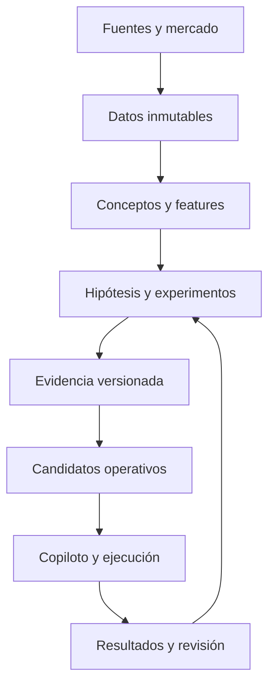

# Investigación estratégica para la evolución de EMTrades

**Fecha de cierre de la investigación:** 16 de agosto de 2026  
**Alcance:** objetivo, método de investigación, arquitectura de conocimiento, validación, microestructura, datos, IA y camino hacia un sistema de trading accionable.  
**Estado:** documento estratégico; no es todavía una especificación de producto, un catálogo definitivo de setups ni una recomendación de inversión.

---

## 1. Resumen ejecutivo

El proyecto no debería definirse todavía como “un bot”, “un scanner”, “un sistema de señales” ni como la automatización de un setup concreto. Su forma más fértil es más amplia:

> **Una infraestructura de conocimiento e investigación capaz de convertir el corpus de EMTrades, la experiencia posterior del usuario y nueva evidencia de mercado en una cartera de edges modernos, trazables, verificables y finalmente accionables.**

El resultado deseado sí es económico: encontrar y ejecutar pocas oportunidades de alta calidad, con gran convexidad y sin necesidad de exposición constante al mercado. Sin embargo, una meta económica ambiciosa no puede usarse como supuesto de diseño estadístico. Los objetivos de win rate, múltiplos R y drawdown deben convertirse en criterios de aceptación que los candidatos han de superar fuera de muestra, después de costes y con incertidumbre explícita.

Las conclusiones centrales de esta investigación son:

1. **El proyecto tiene que construirse primero como laboratorio de conocimiento y edge discovery; después, como trading operating system.** Saltar directamente al producto de señales congelaría demasiado pronto conceptos incompletos y sesgos no examinados.

2. **La prioridad actual continúa siendo completar y auditar la destilación.** El material ya procesado contiene una base valiosa y trazable, pero aún existen vídeos por destilar, preguntas abiertas, contradicciones y afirmaciones sin especificación suficiente. Esa incompletitud no es un defecto: es el mapa de trabajo.

3. **El conocimiento discrecional no se recupera únicamente preguntando “cuáles eran tus reglas”.** Debe elicitarse mediante replays y casos concretos, reconstruyendo señales, expectativas, anomalías, descalificadores, gestión y diferencias entre un experto y un novato. La investigación en análisis cognitivo de tareas respalda este enfoque.

4. **No conviene delimitar aún el universo de setups.** Primero hay que reconstruir el lenguaje y modelo causal completo de EM, después crear una taxonomía amplia de oportunidades, y sólo entonces convertir familias prometedoras en hipótesis medibles.

5. **La literatura sí respalda que el order flow y la liquidez contienen información de muy corto plazo**, pero no prueba por sí sola ninguna lectura específica de EMTrades. OFI, queue imbalance, profundidad, liquidez latente, resiliencia y fragmentación son variables útiles para contrastar ideas; no sustituyen la validación del framework.

6. **Crypto es un terreno técnicamente viable para una fase futura**, especialmente por sus mercados perpetuos, datos accesibles, APIs y herramientas de order flow. También introduce riesgos y regímenes particulares: fragmentación, funding, liquidaciones, mark prices, ADL, actividad 24/7, diferencias de matching y riesgo de venue.

7. **El activo más importante del futuro sistema será un dataset point-in-time de eventos y decisiones**, no una colección de trades ganadores. Hay que registrar todas las oportunidades candidatas, incluidas las descartadas, fallidas, ambiguas y sin operación.

8. **La validación debe registrar cada intento de investigación.** Sin un ledger de hipótesis, variantes y resultados, el backtest overfitting y la selección retrospectiva pueden fabricar una apariencia de edge.

9. **La IA generativa debe asistir, no gobernar.** Es adecuada para recuperación de conocimiento, explicación, anotación, comparación de escenarios y generación de hipótesis. La integridad de datos, cálculo de features, límites de riesgo y construcción de órdenes deben permanecer deterministas; la predicción y el ranking pueden usar estadística o ML sólo cuando existan labels y evaluaciones suficientemente sólidos.

10. **El primer prototipo técnico importante no debería ser un dashboard de señales, sino un entorno de evidencia y evaluación:** corpus versionado, replay reproducible, esquema de anotación, registro de experimentos y benchmark ciego.

La investigación externa permite diseñar un proceso intelectualmente defensible y demostrar que la infraestructura es viable. **No puede demostrar de antemano que EMTrades conserva edge, que un setup alcanzará determinados retornos ni que las metas de rentabilidad sean reproducibles.** Esa evidencia sólo puede nacer del proyecto.

---

## 2. Punto de partida y límites acordados

### 2.1 Objetivo económico

El objetivo último es hacer dinero mediante una operativa selectiva: esperar condiciones estadísticamente favorables, capturar trades con alto retorno potencial respecto al riesgo y aceptar que puede haber periodos con muy pocas o ninguna oportunidad.

Las aspiraciones declaradas —ganadores aproximadamente de 3R a 10R, win rate superior al 60 % sin contar break-even y drawdown tolerable cercano al 15 %— describen el tipo de sistema deseado. No constituyen evidencia ni una promesa. Más adelante deberán traducirse en:

- distribución completa de resultados, no sólo medias;
- intervalos de incertidumbre y estabilidad entre regímenes;
- resultados netos de comisiones, slippage, funding y fallos de ejecución;
- reglas inequívocas para break-even, parciales y múltiples entradas;
- límites de riesgo independientes de la lógica de señal;
- criterios de parada cuando el comportamiento observado deja de ser compatible con el esperado.

### 2.2 Mercado preferente, pero no filtro prematuro

Crypto es el destino operativo preferido por la facilidad de usar criptoactivos o stablecoins como colateral, el coste potencialmente reducido de venues como Hyperliquid o Lighter y la accesibilidad de datos y herramientas de order flow.

No obstante, **la traducción a crypto no debe dirigir todavía la destilación del conocimiento**. Primero debe reconstruirse EMTrades en sus propios términos. Después se estudiará qué principios son invariantes de mercado, cuáles dependen de la microestructura original y cuáles requieren un adaptador específico para cada venue o instrumento.

### 2.3 Track record histórico

La conversión histórica de 3k en 60k sirve como motivación y como indicio personal de que el framework fue útil, pero no existe un diario, histórico o conjunto de análisis con el que auditarla. Por tanto:

- no será requisito reconstruirla;
- no se usará como validación cuantitativa;
- no se intentará “probar” retrospectivamente la cifra;
- la evidencia futura comenzará con datasets y protocolos nuevos.

Esto no bloquea el proyecto. Obliga a adoptar una validación prospectiva y reproducible.

### 2.4 Estado del material revisado

La revisión del repositorio muestra un proceso de destilación serio y trazable:

- 17/17 PDFs procesados;
- 237/237 capturas procesadas;
- 26/26 vídeos transcritos, aproximadamente 27,4 horas y 693 frames;
- 14/16 vídeos de M2020 destilados;
- 10 vídeos de Price Swing transcritos, pendientes de destilación;
- alrededor de 751 referencias de trazabilidad;
- 9 setups y 5 ejemplos de trades ya documentados;
- preguntas abiertas, contradicciones y al menos 24 huecos marcados como “NO ESPECIFICADO EN FUENTES”.

Los pendientes visibles —incluidas las dos partes de Session 11 y la serie Price Swing— significan que todavía no existe un “EM v1 congelado”. También se observó una pequeña inconsistencia de estado en el índice respecto a Session 10, mientras que el registro de pendientes sí parecía actualizado. Es un asunto editorial menor, pero ejemplifica por qué conviene separar el estado del pipeline de la doctrina resultante.

---

## 3. Qué debería llegar a ser el proyecto

La mejor definición no es una aplicación concreta, sino una secuencia de capacidades.

### 3.1 Fase A: laboratorio de conocimiento y edge discovery

Su función es:

- preservar la doctrina original sin reinterpretaciones silenciosas;
- reconstruir relaciones entre principios, conceptos, procesos, setups y ejemplos;
- localizar ambigüedades, contradicciones y conocimiento tácito;
- incorporar respuestas del usuario como una capa diferenciada;
- generar hipótesis sin confundirlas con conocimiento establecido;
- diseñar experimentos, datasets y criterios de refutación;
- comparar familias de oportunidades sin selección retrospectiva.

### 3.2 Fase B: trading operating system

Sólo cuando existan candidatos suficientemente validados, el proyecto puede convertirse gradualmente en un sistema que:

- observa mercados e instrumentos;
- detecta contextos y eventos candidatos;
- reúne evidencia relevante;
- clasifica o prioriza oportunidades;
- explica qué ve y qué falta;
- propone escenarios, invalidaciones y planes;
- controla exposición y riesgo;
- ayuda a ejecutar y revisar;
- aprende de resultados sin reescribir retrospectivamente la doctrina.

### 3.3 Propuesta de misión

> Crear una infraestructura intelectual y tecnológica que transforme un conocimiento de trading que ya fue valioso en una cartera de edges modernos, verificables y accionables, capaz de generar oportunidades de gran convexidad con poco tiempo de pantalla y sin depender de memoria, intuición no documentada o exposición constante al mercado.

### 3.4 La unidad real de progreso

La unidad de progreso no es “una feature construida” ni “un setup añadido”, sino una afirmación que avanza por estados:

1. **Fuente:** algo que EM dijo o mostró.
2. **Interpretación:** significado provisional y contexto.
3. **Regla candidata:** formulación suficientemente precisa.
4. **Hipótesis:** predicción refutable.
5. **Experimento:** protocolo predefinido.
6. **Resultado:** evidencia a favor, en contra o inconclusa.
7. **Decisión:** aceptar provisionalmente, revisar, segmentar o descartar.
8. **Uso operativo:** sólo si supera los gates correspondientes.

La ontología de procedencia de W3C ofrece un modelo formal para relacionar entidades, actividades y agentes. No hace falta adoptar RDF desde el primer día, pero sí conservar el principio de lineage: cada regla y resultado debe poder remontarse a sus fuentes y transformaciones. Véase [W3C PROV-O](https://www.w3.org/TR/prov-o/).

---

## 4. Principios rectores

### 4.1 Separar doctrina, interpretación, hipótesis y evidencia

Una frase del corpus, una explicación del usuario, una hipótesis generada por IA y una correlación hallada en datos son objetos distintos. Deben tener tipos y estados diferentes.

Una clasificación mínima:

| Tipo | Significado | Autoridad inicial |
|---|---|---|
| `[FUENTE]` | afirmación o demostración atribuible a material original | corpus |
| `[USUARIO]` | reconstrucción posterior del conocimiento o experiencia | usuario, con fecha |
| `[DERIVADO]` | inferencia lógica o síntesis | analista/IA, revisable |
| `[HIPÓTESIS]` | proposición refutable todavía no validada | ninguna |
| `[EVIDENCIA]` | resultado de experimento reproducible | protocolo + datos |
| `[OPERATIVO]` | regla autorizada para un contexto y versión | gobernanza del sistema |

### 4.2 La fuente canónica vive fuera del modelo

Un LLM no debe ser la memoria autoritativa del proyecto. El conocimiento ha de existir en archivos y registros versionados, con IDs estables, esquemas y procedencia. El modelo recupera, relaciona y explica ese conocimiento; no lo reemplaza.

### 4.3 La ausencia de trade es una salida válida

Un sistema selectivo no debe optimizarse por actividad. “No hay evidencia suficiente” y “no trade” son estados de primera clase. La abstención debe medirse y recompensarse cuando evita señales de baja calidad.

### 4.4 La ambigüedad no se rellena silenciosamente

Si una fuente no especifica distancia, timing, prioridad entre señales o condición de invalidación, se conserva el hueco. La precisión inventada es más peligrosa que una pregunta abierta visible.

### 4.5 Explorar ampliamente, confirmar estrechamente

La fase exploratoria puede generar muchas familias, features y explicaciones. La fase confirmatoria debe congelar hipótesis, variables, muestra, costes y métricas antes de observar el resultado.

### 4.6 Diseñar primero para aprender, después para automatizar

Cada componente debe mejorar la capacidad de producir evidencia. La automatización sólo es valiosa cuando automatiza un proceso comprendido, medible y supervisable.

---

## 5. Cómo reconstruir conocimiento discrecional sin empobrecerlo

### 5.1 Por qué una lista de reglas no basta

Los expertos suelen reconocer configuraciones por conjuntos de pistas, expectativas y anomalías que no expresan espontáneamente como reglas completas. El enfoque de Naturalistic Decision Making y el modelo recognition-primed describen decisiones basadas en patrones que activan señales relevantes, objetivos, expectativas y acciones plausibles. El método Applied Cognitive Task Analysis propone entrevistas específicas para revelar esas demandas cognitivas. Fuentes: [Naturalistic Decision Making](https://www.sos-vo.org/index.php/system/files/sos_files/Naturalistic_Decision_Making.pdf), [Applied Cognitive Task Analysis](https://pubmed.ncbi.nlm.nih.gov/9819578/) y [Protocols for Cognitive Task Analysis](https://www.ihmc.us/wp-content/uploads/2025/06/Protocols-for-Cognitive-Task-Analysis.pdf).

Por eso, después de terminar el corpus, las sesiones con el usuario deberían usar gráficos congelados y replays, no preguntas abstractas.

### 5.2 Protocolo propuesto para las lagunas

Para cada situación concreta:

1. Mostrar únicamente la información disponible hasta un instante.
2. Pedir una lectura libre antes de enseñar el desenlace.
3. Identificar las primeras pistas atendidas y su orden.
4. Preguntar qué debería ocurrir si la lectura es correcta.
5. Preguntar qué sería sorprendente o descalificador.
6. Reconstruir alternativas: “¿qué tendría que cambiar para que hicieras lo contrario?”.
7. Diferenciar señal de entrada, contexto, gestión e invalidación.
8. Preguntar por errores típicos de alguien que conoce la terminología pero no domina la lectura.
9. Repetir con casos positivos, negativos, ambiguos y edge cases.
10. Registrar la respuesta como `[USUARIO]`, nunca como si procediera de EM.

La buena práctica en elicitación experta también recomienda definir claramente la pregunta, reducir ambigüedades, documentar supuestos y validar el proceso, no sólo recoger una opinión. Véase la guía de [Structured Expert Elicitation](https://www.ncbi.nlm.nih.gov/books/NBK571059/).

### 5.3 Objetivo: un modelo de decisión, no un diccionario

El glosario es necesario, pero la representación útil debe responder:

- ¿Qué estados de mercado reconoce el framework?
- ¿Qué evidencia mueve una lectura de un estado a otro?
- ¿Qué relaciones son necesarias, suficientes, favorecedoras o descalificadoras?
- ¿Qué secuencias temporales importan?
- ¿Qué espera el operador que ocurra a continuación?
- ¿Dónde estaría equivocada la tesis?
- ¿Qué información sólo modifica confianza y cuál cambia la acción?

### 5.4 Esquema mínimo de un concepto o patrón

Cada entidad debería poder contener:

- ID estable y nombre canónico;
- sinónimos y términos cercanos;
- definición y no-definición;
- fuentes exactas;
- contexto de mercado;
- escala temporal;
- precondiciones;
- secuencia observable;
- evidencia favorable y contraria;
- expectativas;
- invalidación;
- relación con otros conceptos;
- ejemplos y contraejemplos;
- estado de certeza;
- preguntas abiertas;
- historial de versiones.

JSON Schema puede servir más adelante para validar estos objetos sin imponer todavía una base de datos concreta. Fuente: [JSON Schema Specification](https://json-schema.org/specification).

### 5.5 Test de comprensión

Un concepto no está formalizado porque tenga una definición elegante. Está formalizado cuando:

- dos anotadores pueden aplicarlo con una concordancia aceptable;
- los desacuerdos revelan fronteras concretas;
- puede reconocerse en casos nuevos sin conocer el resultado;
- genera expectativas refutables;
- distingue ejemplos de contraejemplos.

Para labels categóricos puede utilizarse, entre otras medidas, kappa, entendiendo sus supuestos y limitaciones. Referencia: [Interrater reliability: the kappa statistic](https://pmc.ncbi.nlm.nih.gov/articles/PMC3900052/).

---

## 6. Cómo explorar el universo de oportunidades sin cerrarlo antes de tiempo

### 6.1 No empezar por una lista cerrada de setups

Los setups documentados actualmente son expresiones visibles del corpus, no necesariamente la frontera final del edge. Conviene explorar mediante una matriz de dimensiones:

- **estado:** tendencia, balance, transición, compresión, expansión, agotamiento;
- **localización:** extremos, shelves, zonas aceptadas/rechazadas, áreas de valor, liquidez visible;
- **evento:** ruptura, fallo, wash, reclaim, desplazamiento, absorción, continuación;
- **participación:** agresión, pasividad, desequilibrio, persistencia, agotamiento;
- **secuencia:** preparación → evento → confirmación → resolución;
- **horizonte:** micro, intradía, swing y contexto superior;
- **asimetría:** invalidación cercana frente a recorrido potencial;
- **régimen:** volatilidad, tendencia, liquidez, funding, stress y calendario;
- **dirección:** long y short;
- **instrumento/venue:** sólo en la fase de transferencia.

Esta matriz permite preguntar “¿qué familias existen?” antes de decidir “¿cuál programamos?”.

### 6.2 La fábrica de hipótesis

Cada hipótesis debería adoptar una forma parecida a:

> En el contexto **C**, cuando se observa la secuencia **S** y la evidencia **E**, aumenta/disminuye la probabilidad de **Y** durante el horizonte **H**, salvo los descalificadores **D**; la oportunidad es operable sólo si la invalidación y los costes permiten una asimetría mínima **A**.

El objetivo inicial no es encontrar parámetros óptimos, sino convertir narrativas en objetos que puedan fallar.

### 6.3 Registro completo de investigación

Debe existir un **trial ledger** con:

- ID de hipótesis;
- motivación y procedencia;
- fecha y autor;
- datos examinados antes de formularla;
- definición congelada;
- variantes probadas;
- métricas previstas;
- muestra exploratoria y confirmatoria;
- resultados positivos, negativos e inconclusos;
- decisiones posteriores;
- relación con hipótesis anteriores.

No registrar experimentos fallidos destruye la información necesaria para estimar cuánto data mining ha ocurrido.

### 6.4 Tres cubos de conocimiento

Mantener separados:

1. **Reconstrucción:** qué afirma EMTrades.
2. **Extensión:** qué añade el usuario o la literatura moderna.
3. **Validación:** qué soportan los datos bajo un protocolo definido.

La mezcla prematura hace imposible saber qué exactamente funcionó o dejó de funcionar.

---

## 7. Marco de validación y defensa frente al autoengaño

### 7.1 El principal adversario es el overfitting de investigación

Cuando se prueban suficientes reglas, filtros, mercados, timeframes y salidas, alguna combinación parecerá extraordinaria por azar. Bailey y colaboradores formalizaron la Probability of Backtest Overfitting y el Deflated Sharpe Ratio para abordar el efecto de múltiples intentos y retornos no normales. Fuentes: [The Probability of Backtest Overfitting](https://papers.ssrn.com/sol3/papers.cfm?abstract_id=2326253), [The Deflated Sharpe Ratio](https://papers.ssrn.com/sol3/papers.cfm?abstract_id=2460551) y [The Effects of Backtest Overfitting on Out-of-Sample Performance](https://papers.ssrn.com/sol3/papers.cfm?abstract_id=2308659).

No basta con reservar un pequeño test final si se consulta repetidamente. Cada consulta convierte parcialmente esa muestra en entrenamiento.

### 7.2 Separación de fases

| Fase | Uso | Resultado válido |
|---|---|---|
| Descubrimiento | encontrar patrones, errores de definición y variables | hipótesis, no performance declarable |
| Desarrollo | construir reglas y simulación | especificación congelable |
| Validación | evaluar sin cambios oportunistas | estimación fuera de muestra |
| Shadow/live paper | medir latencia, alertas, decisiones y fills realistas | evidencia operativa |
| Live limitado | comprobar comportamiento económico con riesgo pequeño | evidencia real, aún provisional |
| Escalado | aumentar exposición bajo gates | despliegue controlado |

El preregistro o registro inmutable de hipótesis antes de observar la muestra confirmatoria es una herramienta útil. Véase [OSF Registrations](https://help.osf.io/article/330-welcome-to-registrations).

### 7.3 Dataset correcto: eventos y oportunidades, no sólo trades

La unidad de muestreo debería ser una oportunidad candidata detectada por reglas disponibles en ese instante. Para cada una:

- timestamp y versión de datos;
- instrumento y venue;
- contexto disponible point-in-time;
- features crudas y derivadas;
- captura o replay reproducible;
- lectura humana y/o del modelo antes del desenlace;
- decisión: actuar, abstenerse o esperar;
- plan, invalidación y gestión hipotética;
- camino posterior del precio;
- MAE, MFE, tiempo a invalidación y tiempo a objetivos;
- costes y fill model;
- incidencias de datos o ejecución.

Esto permite evaluar tanto detección como selección. Un diario compuesto únicamente por trades ejecutados oculta los falsos negativos y el coste de oportunidad.

### 7.4 Métricas que deben coexistir

No existe una métrica única suficiente. El cuadro de mando debería incluir:

- expectancy neta en R y moneda;
- distribución de R, no sólo media;
- win/loss/break-even con definición congelada;
- profit factor y payoff ratio;
- drawdown máximo y duración de recuperación;
- exposición temporal y capital en riesgo;
- MAE/MFE y eficiencia de captura;
- frecuencia y concentración por activo/régimen;
- sensibilidad a comisiones, slippage, funding y latencia;
- estabilidad temporal y transversal;
- precisión/recall de la detección si existe scanner;
- calibración probabilística si se emiten probabilidades;
- tasa de abstención y utilidad de esa abstención;
- error operativo humano y del sistema.

Si el sistema produce probabilidades, deben evaluarse con proper scoring rules y gráficos de calibración, no sólo accuracy. Referencia general: [Proper scoring rules for estimation and forecast evaluation](https://arxiv.org/html/2504.01781v3).

### 7.5 Pregunta estadística correcta

La pregunta no es “¿este backtest gana?”, sino:

> ¿Qué rango de comportamiento futuro sigue siendo plausible después de considerar el número de intentos, dependencia temporal, cambios de régimen, costes, selección de muestra y fragilidad paramétrica?

La declaración de la American Statistical Association recuerda que un p-value aislado no mide la magnitud ni la importancia de un efecto y no debe sustituir el razonamiento completo. Fuente: [ASA Statement on Statistical Significance and P-Values](https://magazine.amstat.org/blog/2016/03/07/pvalue-mar16/).

### 7.6 Stress tests necesarios

- desplazar entradas y salidas;
- empeorar slippage y fees;
- variar el tiempo de reacción;
- eliminar los mejores trades;
- evaluar por año, régimen, activo y venue;
- probar definiciones vecinas antes de escoger una;
- simular datos perdidos y desconexiones;
- distinguir fills marketables, limit y parciales;
- comparar contra baselines simples;
- comprobar si el edge depende de uno o dos periodos excepcionales.

### 7.7 Gates de promoción

No deben fijarse aún umbrales numéricos universales, pero sí la lógica:

1. definición aplicable;
2. datos íntegros y reproducibles;
3. señal incremental frente a un baseline;
4. robustez a especificaciones razonables;
5. validación fuera de muestra;
6. viabilidad después de costes;
7. estabilidad en shadow;
8. riesgo operacional aceptable;
9. live limitado compatible con lo esperado;
10. escalado reversible.

---

## 8. Qué aporta realmente la microestructura y el order flow

### 8.1 Evidencia sólida, pero de alcance limitado

La literatura microestructural aporta resultados importantes:

- Cont, Kukanov y Stoikov encontraron que, en intervalos cortos, los cambios de precio guardan una relación aproximadamente lineal con el desequilibrio de flujo de órdenes en el mejor bid/ask, con impacto inversamente relacionado con la profundidad; el volumen negociado resultó una explicación menos robusta. [The Price Impact of Order Book Events](https://arxiv.org/abs/1011.6402).
- Gould y Bonart encontraron poder predictivo del queue imbalance para el siguiente movimiento del mid-price, especialmente en instrumentos large-tick. [Queue Imbalance as a One-Tick-Ahead Price Predictor](https://arxiv.org/abs/1512.03492).
- Extender OFI a varios niveles del libro puede mejorar la explicación contemporánea, aunque muchas señales se degradan con rapidez. [Multi-Level Order-Flow Imbalance](https://arxiv.org/pdf/1907.06230) y [Cross-Impact of Order Flow Imbalance](https://arxiv.org/abs/2112.13213).
- La persistencia de signos en el order flow ha mostrado memoria larga en FX electrónico para instrumentos líquidos estudiados. [The Long Memory of Order Flow in the Foreign Exchange Spot Market](https://arxiv.org/abs/1504.04354).

Estos trabajos apoyan la idea de que agresión, profundidad, desequilibrio y liquidez importan. **No validan automáticamente constructs como shelf, wash, extension o cualquier setup compuesto.** Ayudan a formular mecanismos y variables observables con los que contrastarlos.

### 8.2 El libro visible no es toda la liquidez

La liquidez visible es estratégica y parcial. Existen intenciones latentes, cancelaciones, replenishment, órdenes iceberg y liquidez que sólo aparece ante determinadas condiciones. El concepto de latent order book modela esta diferencia entre intención agregada y libro mostrado. Véase [A fully consistent, minimal model for non-linear market impact](https://arxiv.org/pdf/1506.03758).

Implicación para EMTrades: una lectura visual del libro o footprint puede ser informativa, pero no debe tratarse como fotografía completa de oferta y demanda. Importan la reacción, persistencia y secuencia, no sólo una pared estática.

### 8.3 Fragmentación

En FX, la fragmentación y la internalización afectan la visión disponible de la liquidez. Fuentes: [BIS, FX trade execution: complex and highly fragmented](https://www.bis.org/publ/qtrpdf/r_qt1912g.htm) y [BIS, The liquidity consequences of fragmentation](https://www.bis.org/publ/work1229.pdf).

Crypto también está fragmentado entre CEX, DEX, perps y spot. Makarov y Schoar documentaron fragmentación y arbitrajes recurrentes entre exchanges, además de una relación relevante entre signed volume y retornos. [Trading and Arbitrage in Cryptocurrency Markets](https://dspace.mit.edu/entities/publication/7f91bfb5-ba77-4d0e-9c79-ec75e104e6cc).

Por tanto, el sistema futuro necesitará distinguir:

- señal local del venue;
- señal agregada cross-venue;
- formación principal de precio;
- venue de ejecución;
- divergencias causadas por latencia o mecánicas diferentes.

### 8.4 Perpetuos, funding y liquidaciones

Los perpetual futures incorporan funding para mantener el precio cerca del subyacente, pero las desviaciones y mecanismos concretos difieren entre venues. [Fundamentals of Perpetual Futures](https://arxiv.org/html/2212.06888v5).

Las liquidaciones forzadas y el apalancamiento pueden amplificar movimientos y producir colas que un modelo normal subestima. [Liquidation, Leverage and Optimal Margin in Bitcoin Futures Markets](https://arxiv.org/abs/2102.04591). El BIS también analiza el carry en mercados crypto: [Crypto carry](https://www.bis.org/publ/work1087.pdf).

Estas variables podrían aportar evidencia a patrones de extensión, wash, continuación o reversión, pero sólo después de definirlos independientemente y estudiar si añaden información incremental.

### 8.5 Qué investigar más adelante

Sin elegir todavía setups, la capa microestructural debería poder examinar:

- OFI y multi-level OFI;
- queue imbalance;
- profundidad y pendiente del libro;
- cancelaciones, replenishment y resiliencia;
- agresión y cumulative delta;
- absorción operacionalmente definida;
- velocidad de trades y cambios de régimen;
- liquidez cross-venue;
- basis, premium y funding;
- open interest y liquidaciones, si la fuente es fiable;
- reacción del precio ante esfuerzo de flujo;
- calidad y estabilidad de cada feature por venue.

La prioridad no es acumular indicadores, sino comprobar qué variables mejoran una predicción o decisión previamente definida.

---

## 9. Viabilidad de crypto: venues, datos y herramientas

Esta sección describe el panorama a fecha de cierre. Tarifas, endpoints y políticas son información mutable; deben verificarse de nuevo antes de construir o operar.

### 9.1 Hyperliquid

La documentación oficial ofrece:

- [datos históricos](https://hyperliquid.gitbook.io/hyperliquid-docs/historical-data), incluidos ficheros de market data;
- [WebSocket API](https://hyperliquid.gitbook.io/hyperliquid-docs/for-developers/api/websocket) y [suscripciones](https://hyperliquid.gitbook.io/hyperliquid-docs/for-developers/api/websocket/subscriptions);
- [Info endpoint](https://hyperliquid.gitbook.io/hyperliquid-docs/for-developers/api/info-endpoint);
- reglas de [fees](https://hyperliquid.gitbook.io/hyperliquid-docs/trading/fees), [order types](https://hyperliquid.gitbook.io/hyperliquid-docs/trading/order-types), [order book](https://hyperliquid.gitbook.io/hyperliquid-docs/trading/order-book), [rate limits](https://hyperliquid.gitbook.io/hyperliquid-docs/for-developers/api/rate-limits-and-user-limits) y [liquidations](https://hyperliquid.gitbook.io/hyperliquid-docs/trading/liquidations);
- detalles relevantes como la activación de TP/SL por mark price en su [documentación de TP/SL](https://hyperliquid.gitbook.io/hyperliquid-docs/trading/take-profit-and-stop-loss-orders-tp-sl).

Conclusión: es técnicamente factible capturar datos, investigar y eventualmente ejecutar. Aun así, debe auditarse la granularidad histórica, secuencia, timestamps, snapshots, gaps y capacidad de reconstrucción exacta del libro.

### 9.2 Lighter

Lighter publica [documentación general](https://docs.lighter.xyz/), [API de trading](https://docs.lighter.xyz/trading/api), [funding](https://docs.lighter.xyz/trading/funding), [liquidaciones](https://docs.lighter.xyz/trading/liquidations-and-llp-insurance-fund) y [fees](https://docs.lighter.xyz/trading/trading-fees). En la fecha de consulta, la documentación indicaba ausencia de maker/taker fees para cuentas Standard; es una condición comercial mutable, no un supuesto permanente.

Conclusión: también merece un benchmark técnico, pero la elección de venue debe considerar calidad de mercado, liquidez efectiva, API, historial, fills, riesgo de infraestructura y no sólo comisión nominal.

### 9.3 Proveedores y herramientas a comparar

| Opción | Uso potencial | Pregunta que debe resolver el PoC |
|---|---|---|
| Datos oficiales de venue | verdad local y coste bajo | ¿permiten reconstrucción y replay sin huecos? |
| [Tardis.dev](https://tardis.dev/) | histórico tick-level normalizado y replay | ¿cubre venues/canales y calidad temporal necesarios? |
| [Tardis order books](https://docs.tardis.dev/faq/order-books) | reconstrucción de libro | ¿cómo gestiona snapshots, deltas y gaps? |
| [Tardis Node](https://github.com/tardis-dev/tardis-node) | cliente/replay open source | ¿facilita un pipeline reproducible? |
| [Amberdata para Hyperliquid](https://docs.amberdata.io/changelog/hyperliquid-futures-data-now-available) | dataset comercial | ¿qué aporta frente a fuente oficial y a qué coste? |
| [Allium Hyperliquid](https://docs.allium.so/historical-data/supported-blockchains/hyperliquid/overview) | histórico/query | ¿es suficiente para investigación microestructural? |
| [Kaiko tick-level trades](https://docs.kaiko.com/stream/data-feeds/level-1-and-level-2-data/level-1-tick-level/all-trades) | datos institucionales | ¿calidad adicional justifica coste? |
| [Dune Hyperliquid](https://docs.dune.com/data-catalog/community/hyperliquid/market-data) | análisis y consultas | ¿sirve para exploración agregada, no para replay L2? |
| [Bookmap](https://bookmap.com/features/) + [API](https://bookmap.com/knowledgebase/docs/API) | exploración visual, replay y prototipos | ¿permite anotar/reproducir casos de forma sistemática? |
| [Exocharts](https://exocharts.com/) | order flow visual | ¿cobertura, exportación y automatización suficientes? |
| [ATAS](https://atas.net/) | footprint/order flow | ¿integración y datos adecuados para crypto objetivo? |

No se recomienda suscribirse a una pila completa antes de un test comparativo. El PoC debe usar una muestra corta idéntica y evaluar:

- cobertura y granularidad;
- timestamps y orden de eventos;
- snapshots/deltas y gaps;
- definiciones de trades y side;
- consistencia con la UI del venue;
- normalización cross-venue;
- licencia, retención y exportación;
- coste inicial y recurrente;
- latencia y límites;
- facilidad de replay y auditoría.

### 9.4 Riesgos específicos que deben entrar en el diseño

- mark price frente a last/index;
- funding y cambios de fórmula;
- liquidation engine y ADL;
- mantenimiento y cambios de API;
- rate limits;
- secuenciación de WebSocket y resync;
- riesgo smart contract/protocolo/oracle;
- riesgo de stablecoin y colateral;
- liquidez nocturna y fines de semana;
- manipulación local y listings jóvenes;
- diferencias entre backtest con prints y fill real en cola;
- concentración de capital en un único venue.

---

## 10. Papel correcto de la IA

### 10.1 Lo que no debe ser

La IA no debería funcionar como un oráculo que mira un chart y emite “long/short” sin trazabilidad. Los modelos generativos pueden confabular, sobreajustarse a la narrativa mostrada y provocar automation bias. El NIST AI Risk Management Framework y su perfil para IA generativa recomiendan evaluar contra ground truth, documentar limitaciones y diseñar supervisión humana. Fuentes: [NIST AI RMF 1.0](https://nvlpubs.nist.gov/nistpubs/ai/NIST.AI.100-1.pdf), [NIST Generative AI Profile](https://nvlpubs.nist.gov/nistpubs/ai/NIST.AI.600-1.pdf) y [NIST AI RMF — Measure](https://airc.nist.gov/airmf-resources/playbook/measure/).

### 10.2 Reparto de responsabilidades

| Capa | Responsabilidad adecuada |
|---|---|
| Determinista | ingestión, integridad, timestamps, features definidas, PnL, sizing, límites, órdenes, audit log |
| Estadística/ML | estimación, clasificación, ranking, calibración, detección de régimen, anomalías |
| LLM/VLM | recuperar doctrina, explicar, comparar escenarios, anotar, generar preguntas e hipótesis |
| Humano | aprobar doctrina e hipótesis, resolver ambigüedades, autorizar riesgo y ejecución durante las fases iniciales |

### 10.3 RAG antes que fine-tuning

Al principio conviene:

- un corpus versionado y recuperable;
- citas obligatorias a fuentes;
- esquemas de salida estructurados;
- benchmark de preguntas y gráficos congelados;
- política de abstención;
- comparación entre respuestas y labels humanos.

El fine-tuning sólo tiene sentido cuando:

- el vocabulario y esquema son estables;
- existen suficientes ejemplos consistentes;
- se conoce la tarea exacta que mejora;
- un benchmark demuestra la carencia del modelo base + retrieval;
- puede repetirse la evaluación tras cada versión.

La investigación reciente sobre RAG sensible a versiones señala que los sistemas estándar pueden fallar cuando una respuesta depende de qué versión de un corpus estaba vigente. Esto refuerza la necesidad de IDs y timestamps. Fuente emergente: [VersionRAG](https://arxiv.org/html/2510.08109v1).

### 10.4 Modelos multimodales y series temporales

Los benchmarks financieros multimodales muestran progreso en razonamiento sobre documentos y gráficos, pero también brechas y sensibilidad a tareas. Son evidencia de capacidad potencial, no prueba de reconocimiento fiable de setups: [MME-Finance](https://arxiv.org/html/2411.03314v1), [FinMR](https://arxiv.org/html/2510.07852v1) y [FinMTM](https://arxiv.org/html/2602.03130v1).

Del mismo modo, los foundation models de series temporales no deben conectarse directamente a precios y asumirse como edge. Un estudio sobre TimesFM en finanzas encontró resultados base insatisfactorios y mejoras mediante adaptación en sus benchmarks. [Finetuning foundation models for time-series forecasting](https://ar5iv.labs.arxiv.org/html/2412.09880).

La lección es metodológica: cualquier modelo debe ganar su sitio mediante un benchmark concreto, point-in-time y resistente a contaminación.

### 10.5 Escalera de automatización

1. **Archivista:** recupera y cita conocimiento.
2. **Analista:** estructura observaciones y preguntas.
3. **Anotador:** propone labels para revisión humana.
4. **Investigador:** genera hipótesis y experimentos.
5. **Scanner shadow:** detecta candidatos sin alertar o ejecutar.
6. **Copiloto:** alerta y explica; el humano decide.
7. **Ejecutor supervisado:** prepara órdenes dentro de límites.
8. **Automatización limitada:** ejecuta únicamente familias validadas y con circuit breakers.

Cada nivel requiere evaluaciones adicionales. El salto de “explica bien” a “arriesga capital” nunca debe ser implícito.

---

## 11. Arquitectura técnica de referencia

No es una selección definitiva de stack. Es una arquitectura lógica que preserva opciones.

### 11.1 Pipeline de evidencia a acción

El bucle vuelve a experimentación, no reescribe automáticamente la doctrina.

### 11.2 Componentes

**A. Knowledge base**

- corpus original;
- destilados y fuentes;
- conceptos y relaciones;
- preguntas/contradicciones;
- aportaciones del usuario;
- versiones y procedencia.

**B. Raw market store**

- eventos originales inmutables;
- metadatos de venue y canal;
- hashes/controles de integridad;
- snapshots y gaps;
- normalización como capa derivada, no sustituto del raw.

**C. Feature y event layer**

- features deterministas versionadas;
- eventos candidatos;
- labels y anotadores;
- disponibilidad temporal exacta.

**D. Experiment registry**

- hipótesis;
- configs;
- datasets y splits;
- código/modelo;
- métricas;
- artefactos;
- decisión y reviewer.

Herramientas como MLflow ilustran el valor de un registro de versiones y evaluaciones, aunque no tiene por qué ser la elección final. Referencias: [MLflow Model Registry](https://mlflow.org/docs/latest/ml/model-registry/) y [MLflow version tracking](https://mlflow.org/docs/latest/genai/version-tracking/).

**E. Runtime de mercado**

- conexiones;
- estado;
- scanner;
- ranking;
- alertas;
- execution adapter;
- risk engine independiente;
- observabilidad y kill switches.

**F. Interfaz de investigación/operación**

- replay;
- evidencia sincronizada;
- explicación con fuentes;
- registro de decisión;
- revisión posterior.

### 11.3 Almacenamiento: empezar simple

Para investigación inicial, una combinación de ficheros Parquet particionados y DuckDB puede proporcionar consultas reproducibles sin operar infraestructura compleja. DuckDB soporta lectura y pushdown sobre Parquet. [DuckDB — Querying Parquet Files](https://duckdb.org/docs/lts/data/parquet/overview.html).

Una base de series temporales o columnar —por ejemplo QuestDB o ClickHouse— puede añadirse cuando el volumen live, la concurrencia y los dashboards lo justifiquen. Referencias de capacidades: [QuestDB para market data](https://questdb.com/glossary/market-data-time-series-database/) y [ClickHouse para time series](https://clickhouse.com/resources/engineering/what-is-time-series-database).

La regla es: **raw inmutable primero; optimización de serving después**.

### 11.4 MCP como interfaz, no como cerebro

Model Context Protocol puede exponer recursos y herramientas a agentes: documentación, conceptos, resultados, consultas y replays. Su arquitectura distingue recursos de contexto y herramientas accionables. Fuentes oficiales: [MCP Architecture](https://modelcontextprotocol.io/docs/2026-07-28/learn/architecture), [MCP Resources](https://modelcontextprotocol.io/specification/2026-07-28/server/resources) y [MCP Tools](https://modelcontextprotocol.io/specification/2026-07-28/server/tools).

Uso recomendado por etapas:

- primero, recursos read-only de conocimiento y evidencia;
- después, herramientas de consulta y experimentación sin capital;
- más tarde, preparación de órdenes;
- ejecución sólo con autorización, allowlists, límites y audit log.

MCP resuelve conectividad. No resuelve veracidad, memoria, versionado, validación ni riesgo.

---

## 12. Diseño humano: selectividad, atención y sostenibilidad

El objetivo operativo implica que el sistema debe proteger la atención, no maximizar notificaciones.

### 12.1 Alertas como producto de decisión

Una alerta útil debería contener:

- qué condición se detectó;
- por qué importa;
- evidencia favorable y contraria;
- qué falta para completarse;
- invalidación;
- horizonte de validez;
- calidad de datos;
- confianza calibrada o estado de incertidumbre;
- enlace al replay y a la doctrina.

### 12.2 Alert fatigue

La evidencia directa disponible procede sobre todo de dominios como sanidad, donde demasiadas alertas inespecíficas degradan la respuesta. Debe usarse como analogía de factores humanos, no como prueba de trading. Revisiones: [A Systematic Review of the Effects of Alert Fatigue](https://pubmed.ncbi.nlm.nih.gov/29112077/) y [Clinical decision support alert fatigue](https://pubmed.ncbi.nlm.nih.gov/29436470/).

La implicación razonable es experimentar con precisión, prioridad, ventanas y feedback, y no asumir que más cobertura mejora el comportamiento.

### 12.3 Ritual operativo compatible con poca pantalla

El sistema futuro podría organizar el trabajo en:

- planificación periódica de instrumentos y contextos;
- monitorización automática silenciosa;
- alertas escalonadas: watch → armed → actionable → invalidated;
- ventanas explícitas de atención;
- revisión breve posterior;
- revisión semanal de procesos y mensual de evidencia;
- cero obligación de producir trades.

### 12.4 Separación psicológica y epistemológica

- El diario captura decisiones y emociones.
- La doctrina describe el modelo.
- El dataset guarda hechos observables.
- El registro de experimentos guarda investigación.
- El ledger de riesgo guarda exposición y violaciones.

Un mal trade no debe cambiar una doctrina; una serie de datos bajo un protocolo sí puede iniciar su revisión.

---

## 13. Arquitectura de riesgo

El riesgo no puede depender del mismo modelo que propone la oportunidad.

### 13.1 Capas independientes

- límites por trade, día, semana y drawdown;
- exposición agregada y correlacionada;
- límites por activo, venue y colateral;
- control de apalancamiento efectivo;
- máximos de slippage y spread;
- bloqueo ante datos stale, gaps o desincronización;
- cancel-all y kill switch;
- límites de frecuencia y órdenes;
- estado de funding/liquidación/ADL;
- reconciliación de posiciones y órdenes;
- degradación segura si falla un componente.

### 13.2 El 15 % de drawdown como frontera, no presupuesto

Aceptar un máximo cercano al 15 % no significa dimensionar normalmente para consumirlo. El sistema debe tener escalones de reducción y pausa antes de alcanzar la frontera, y distinguir:

- variación esperada del edge;
- desviación estadística anómala;
- cambio de régimen;
- fallo de ejecución/datos;
- ruptura de disciplina;
- concentración inadvertida.

El Kelly criterion puede ser útil como marco conceptual de crecimiento, pero sus resultados son muy sensibles a estimaciones de probabilidad y payoff. Existen formulaciones con restricciones de drawdown y trabajos que discuten sus limitaciones. Fuentes: [Risk-Constrained Kelly Gambling](https://arxiv.org/pdf/1603.06183) y [On the limitations of the Kelly criterion](https://arxiv.org/pdf/1710.01787).

Por tanto, el sizing futuro debe ser conservador respecto a la incertidumbre, con caps duros y escalado sólo después de evidencia live.

### 13.3 Riesgo de modelo y de investigación

Además del riesgo de mercado, deben vigilarse:

- labels inestables;
- leakage;
- cambios de proveedor;
- drift de microestructura;
- dependencia de un único feature;
- sobreconfianza por narrativa;
- múltiples pruebas no registradas;
- contaminación de benchmarks;
- cambios de versión no auditados;
- overrides humanos sin razón registrada.

---

## 14. Hoja de ruta recomendada y gates

### Fase 0 — Completar el corpus actual

**Objetivo:** terminar lo ya iniciado sin cambiar de problema.

- destilar los vídeos restantes;
- auditar trazabilidad y consistencia editorial;
- consolidar preguntas y contradicciones;
- evitar añadir reglas externas al cuerpo canónico.

**Gate:** cobertura completa del material conocido y estado del pipeline inequívoco.

### Fase 1 — Auditoría global y elicitación

**Objetivo:** descubrir qué falta para reconstruir el modelo, no para programarlo.

- mapa global de conceptos y relaciones;
- clusters de lagunas;
- sesiones de replay y entrevistas cognitivas con el usuario;
- ejemplos, contraejemplos y casos ambiguos;
- separar `[FUENTE]`, `[USUARIO]` y `[DERIVADO]`.

**Gate:** las principales lagunas han sido respondidas, declaradas irresolubles o conservadas como incertidumbre.

### Fase 2 — Congelar EM v1

**Objetivo:** obtener una reconstrucción versionada y auditable.

- ontología mínima;
- procesos y estados;
- setups actuales sin afirmar exhaustividad;
- glosario y reglas de interpretación;
- test ciego de comprensión.

**Gate:** otra persona o agente puede recuperar, citar y aplicar conceptos con errores visibles y medibles.

### Fase 3 — Deep research y expansión sistemática

**Objetivo:** relacionar EM v1 con microestructura, literatura, mercados y herramientas modernas.

- mecanismos plausibles;
- variables observables;
- taxonomía amplia de oportunidades;
- mapa de invariantes vs dependencias de mercado;
- hipótesis alternativas y refutaciones.

**Gate:** cada extensión está identificada como externa y no contamina la reconstrucción.

### Fase 4 — Formalización y dataset piloto

**Objetivo:** convertir familias, no sólo setups favoritos, en objetos medibles.

- esquemas y labels;
- anotación de replays;
- medición de concordancia;
- captura point-in-time;
- trial ledger;
- simulador de costes/fills básico.

**Gate:** las definiciones son reproducibles y los datos soportan el experimento.

### Fase 5 — Exploración y selección de candidatos

**Objetivo:** comparar familias bajo el mismo protocolo.

- baselines;
- análisis por regímenes;
- features incrementales;
- robustez;
- registro de todos los intentos.

**Gate:** candidatos congelados antes de validación.

### Fase 6 — Validación confirmatoria

**Objetivo:** estimar evidencia fuera de muestra después de costes.

- splits temporales y walk-forward adecuados;
- muestra final protegida;
- stress tests;
- análisis de multiplicidad y fragilidad;
- criterios de abandono.

**Gate:** evidencia suficientemente fuerte para justificar shadow, no todavía capital significativo.

### Fase 7 — Copiloto shadow

**Objetivo:** validar el sistema como instrumento de decisión.

- alertas silenciosas y después visibles;
- medir falsos positivos/negativos;
- tiempos de reacción;
- utilidad de explicaciones;
- abstención;
- paper fills.

**Gate:** estabilidad operativa y utilidad demostrada sin alterar reglas sobre la marcha.

### Fase 8 — Live limitado y escalado reversible

**Objetivo:** obtener evidencia real con riesgo pequeño.

- capital limitado;
- límites independientes;
- comparación con shadow;
- revisión de slippage y comportamiento;
- escalado gradual y reversible.

**Gate:** compatibilidad sostenida con las expectativas, sin violaciones operativas o de riesgo.

---

## 15. Preguntas de investigación: qué queda respondido y qué no

### 15.1 Respondidas estratégicamente por esta investigación

**¿Tiene sentido convertir el material en algo más que documentación?**  
Sí. Existe un camino coherente desde corpus trazable a laboratorio, y desde laboratorio a copiloto/operating system.

**¿Debe empezarse por construir señales?**  
No. Primero deben completarse reconstrucción, elicitación, ontología, datasets y evaluación.

**¿Puede formalizarse conocimiento discrecional sin destruirlo?**  
Sí, si se combinan casos concretos, secuencias, expectativas, contraejemplos, trazabilidad y medida de concordancia; una lista plana de reglas sería insuficiente.

**¿Hay fundamento para incorporar order flow y microestructura?**  
Sí. OFI, queue imbalance, profundidad, resiliencia y fragmentación tienen soporte empírico. Su relación con EM debe probarse, no asumirse.

**¿Crypto ofrece infraestructura suficiente?**  
Sí. Hay APIs, datos oficiales, proveedores tick-level y herramientas de replay. La calidad exacta debe verificarse con un PoC.

**¿Debe usarse IA?**  
Sí, sobre todo para recuperar, estructurar, explicar, anotar y acelerar investigación. No debe ser autoridad de datos, riesgo u órdenes.

**¿RAG o fine-tuning?**  
RAG/versionado/evals primero. Fine-tuning sólo cuando exista una tarea estable, labels suficientes y mejora demostrable.

**¿Qué construir primero después del corpus?**  
Un entorno de conocimiento, anotación, replay y evaluación; no un bot autónomo.

### 15.2 Sólo pueden responderse empíricamente

- ¿Qué conceptos de EM contienen información incremental?
- ¿Cuáles son invariantes entre mercados y cuáles dependientes de estructura?
- ¿Qué universo de setups emerge del modelo completo?
- ¿Qué definiciones pueden aplicarse consistentemente?
- ¿Qué horizontes y regímenes contienen edge?
- ¿Qué añade realmente el order flow frente a precio/volumen más simples?
- ¿Qué venue lidera la formación de precio para cada instrumento?
- ¿Puede lograrse una distribución próxima a los objetivos económicos declarados?
- ¿Cuál es la frecuencia real de oportunidades de alta calidad?
- ¿Cuánto se degrada el resultado por fees, funding, slippage y latencia?
- ¿Qué parte del valor proviene de selección, entrada, gestión o sizing?
- ¿La automatización mejora la decisión o introduce sobreconfianza y ruido?

### 15.3 Deben responderse con decisiones del usuario, pero más adelante

- capital operativo inicial y límites absolutos;
- instrumentos y venues del piloto;
- grado de discrecionalidad permitido;
- ventanas horarias y estilo de atención;
- autoridad exacta del copiloto;
- trade-offs entre frecuencia, convexidad y estabilidad;
- tolerancia a infraestructura y costes de datos;
- condiciones personales para pausar o reducir riesgo.

No es necesario resolverlas mientras el corpus siga incompleto.

---

## 16. Artefactos que el proyecto debería producir

Sin imponer todavía nombres de carpetas, el sistema de conocimiento debería acabar conteniendo:

1. **Corpus canónico** con fuentes y destilación.
2. **Mapa ontológico** de conceptos, relaciones y estados.
3. **Registro de procedencia** de cada afirmación.
4. **Banco de preguntas y contradicciones** con estado.
5. **Banco de casos** positivos, negativos, ambiguos y edge cases.
6. **Manual de anotación** y concordancia.
7. **Taxonomía de oportunidades** abierta y versionada.
8. **Registro de hipótesis y experimentos**, incluidos fallos.
9. **Catálogo de datasets** con disponibilidad point-in-time.
10. **Benchmark congelado** para humanos, reglas y modelos.
11. **Registro de modelos/prompts/configs** y evaluaciones.
12. **Especificación de riesgo** independiente.
13. **Diario de decisiones** y outcomes live/shadow.
14. **Changelog doctrinal**: qué cambió, por qué y con qué evidencia.

Estos artefactos constituyen el puente entre “documentación exportable a una IA” y “sistema que puede actuar sin perder su epistemología”.

---

## 17. Qué no hacer todavía

- no declarar SWE o cualquier otro patrón como centro del sistema;
- no transferir todo a crypto antes de entender el modelo original;
- no comprar una pila completa de datos y herramientas;
- no construir primero una interfaz vistosa;
- no ajustar parámetros a resultados deseados;
- no usar el antiguo track record como ground truth;
- no confundir ejemplos didácticos con muestra estadística;
- no fine-tunear un modelo sobre labels inestables;
- no permitir que un LLM calcule o ignore límites de riesgo;
- no automatizar ejecución antes de shadow y live limitado;
- no borrar contradicciones mediante una síntesis “limpia”;
- no cambiar una hipótesis después de ver el test sin registrarla como una nueva versión;
- no medir el progreso por número de trades o alertas.

---

## 18. Próximo movimiento recomendado

El siguiente paso no es otra exploración de setups. Es terminar el trabajo epistemológico que permite que todas las exploraciones futuras sean útiles:

1. completar las destilaciones pendientes;
2. realizar una auditoría transversal de todo el corpus;
3. agrupar preguntas por concepto, secuencia, contexto, gestión e invalidación;
4. preparar replays y casos para sesiones de elicitación con el usuario;
5. congelar una versión EM v1 diferenciando fuente, usuario y derivación;
6. diseñar el esquema mínimo de casos, hipótesis y evidencia;
7. sólo entonces iniciar el inventario amplio de oportunidades y la investigación de transferencia.

El primer deliverable técnico posterior debería ser un **prototype de replay + anotación + evaluación** capaz de responder: “¿podemos aplicar esta idea de forma consistente y medir qué esperaba antes de conocer el resultado?”. Si la respuesta es no, todavía no hay objeto válido que automatizar.

---

## 19. Conclusión

El valor potencial de EMTrades no reside únicamente en conservar explicaciones antiguas ni en reproducir la operativa histórica. Reside en utilizar ese conocimiento como semilla de una disciplina de investigación propia.

La arquitectura más prometedora es una cadena de evidencia:

> **fuente → concepto → interpretación → hipótesis → experimento → evidencia → regla operativa → decisión → resultado → revisión**

Si se mantiene la trazabilidad entre estos estados, el proyecto podrá evolucionar sin olvidar lo aprendido ni confundir intuición, literatura, IA y datos. Si se omiten esos límites, es fácil construir un sistema sofisticado que sólo racionalice retrospectivamente el mercado.

La ambición correcta, vista desde arriba, no es predecir todos los movimientos ni producir actividad. Es desarrollar una máquina de aprender qué merece atención, qué merece riesgo y cuándo la mejor operación es ninguna.

---

## 20. Fuentes y criterio de uso

### Fuentes primarias o académicas consolidadas

- [Cont, Kukanov & Stoikov — The Price Impact of Order Book Events](https://arxiv.org/abs/1011.6402)
- [Gould & Bonart — Queue Imbalance as a One-Tick-Ahead Price Predictor](https://arxiv.org/abs/1512.03492)
- [Xu, Gould & Howison — Multi-Level Order-Flow Imbalance](https://arxiv.org/pdf/1907.06230)
- [Cont, Cucuringu & Zhang — Cross-Impact of Order Flow Imbalance](https://arxiv.org/abs/2112.13213)
- [Gould, Porter & Howison — Long Memory of Order Flow in FX](https://arxiv.org/abs/1504.04354)
- [Donier et al. — Latent liquidity and non-linear market impact](https://arxiv.org/pdf/1506.03758)
- [Makarov & Schoar — Trading and Arbitrage in Cryptocurrency Markets](https://dspace.mit.edu/entities/publication/7f91bfb5-ba77-4d0e-9c79-ec75e104e6cc)
- [Fundamentals of Perpetual Futures](https://arxiv.org/html/2212.06888v5)
- [Liquidation, Leverage and Optimal Margin in Bitcoin Futures](https://arxiv.org/abs/2102.04591)
- [BIS — Crypto carry](https://www.bis.org/publ/work1087.pdf)
- [BIS — FX trade execution and fragmentation](https://www.bis.org/publ/qtrpdf/r_qt1912g.htm)
- [BIS — Liquidity consequences of fragmentation](https://www.bis.org/publ/work1229.pdf)
- [Bailey et al. — Probability of Backtest Overfitting](https://papers.ssrn.com/sol3/papers.cfm?abstract_id=2326253)
- [Bailey & López de Prado — Deflated Sharpe Ratio](https://papers.ssrn.com/sol3/papers.cfm?abstract_id=2460551)
- [Bushey & Crandall — Applied Cognitive Task Analysis](https://pubmed.ncbi.nlm.nih.gov/9819578/)
- [Protocols for Cognitive Task Analysis](https://www.ihmc.us/wp-content/uploads/2025/06/Protocols-for-Cognitive-Task-Analysis.pdf)
- [Naturalistic Decision Making](https://www.sos-vo.org/index.php/system/files/sos_files/Naturalistic_Decision_Making.pdf)

### Estándares y documentación oficial

- [W3C PROV-O](https://www.w3.org/TR/prov-o/)
- [JSON Schema](https://json-schema.org/specification)
- [NIST AI RMF](https://nvlpubs.nist.gov/nistpubs/ai/NIST.AI.100-1.pdf)
- [NIST Generative AI Profile](https://nvlpubs.nist.gov/nistpubs/ai/NIST.AI.600-1.pdf)
- [MCP Architecture](https://modelcontextprotocol.io/docs/2026-07-28/learn/architecture)
- [Hyperliquid documentation](https://hyperliquid.gitbook.io/hyperliquid-docs)
- [Lighter documentation](https://docs.lighter.xyz/)
- [DuckDB Parquet documentation](https://duckdb.org/docs/lts/data/parquet/overview.html)

### Fuentes emergentes o benchmarks recientes

Los trabajos de modelos multimodales, foundation models y RAG versionado se han usado para mapear posibilidades y limitaciones, no como evidencia de rentabilidad o madurez operativa:

- [MME-Finance](https://arxiv.org/html/2411.03314v1)
- [FinMR](https://arxiv.org/html/2510.07852v1)
- [FinMTM](https://arxiv.org/html/2602.03130v1)
- [VersionRAG](https://arxiv.org/html/2510.08109v1)
- [Finetuning foundation models for financial time-series forecasting](https://ar5iv.labs.arxiv.org/html/2412.09880)

### Nota de interpretación

Las fuentes oficiales describen capacidades y reglas vigentes en la fecha consultada, pero pueden cambiar. Los papers microestructurales establecen fenómenos en mercados y muestras concretos; no deben generalizarse automáticamente a cada criptoactivo o venue. Los benchmarks recientes de IA describen capacidad experimental, no fiabilidad para arriesgar capital. Todas las afirmaciones de edge permanecen como hipótesis hasta validarse en el sistema propuesto.
